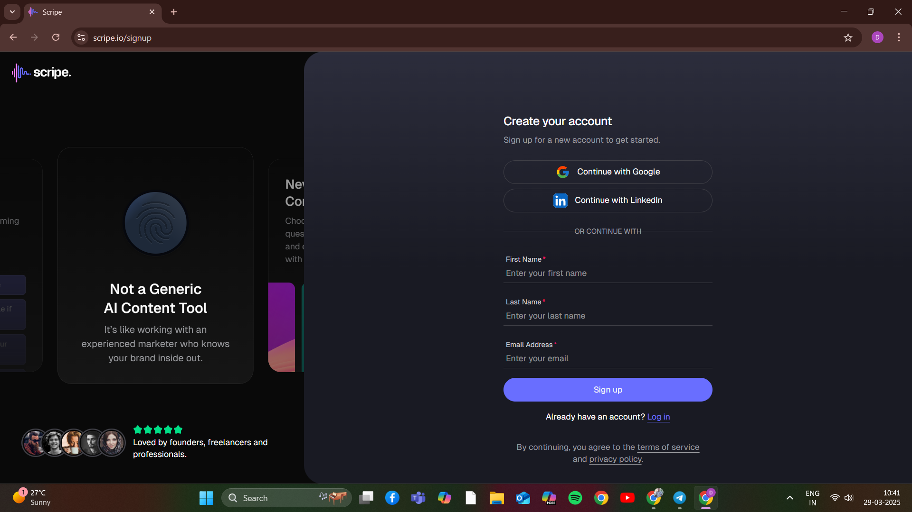
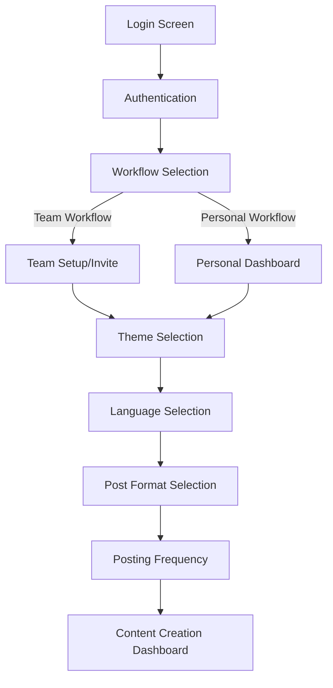
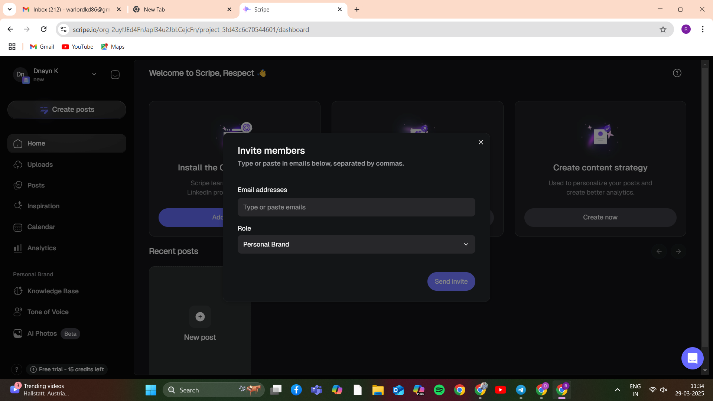
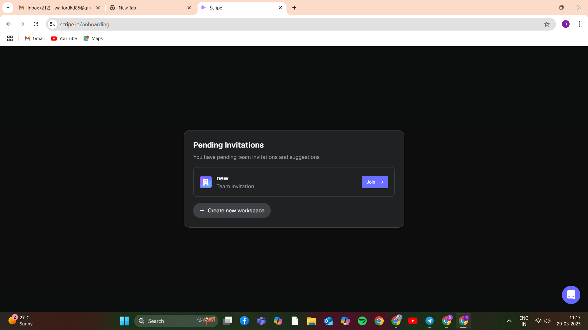
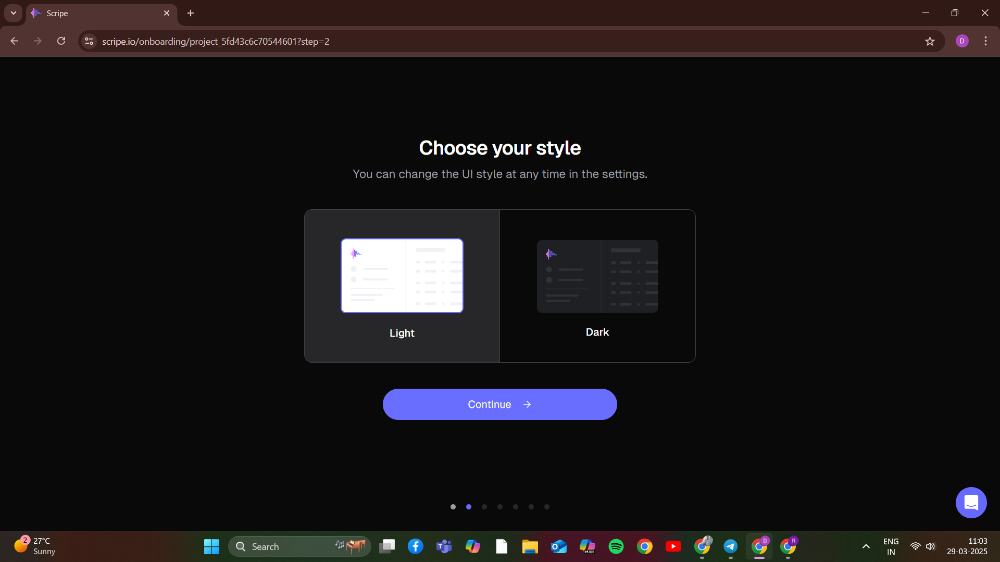
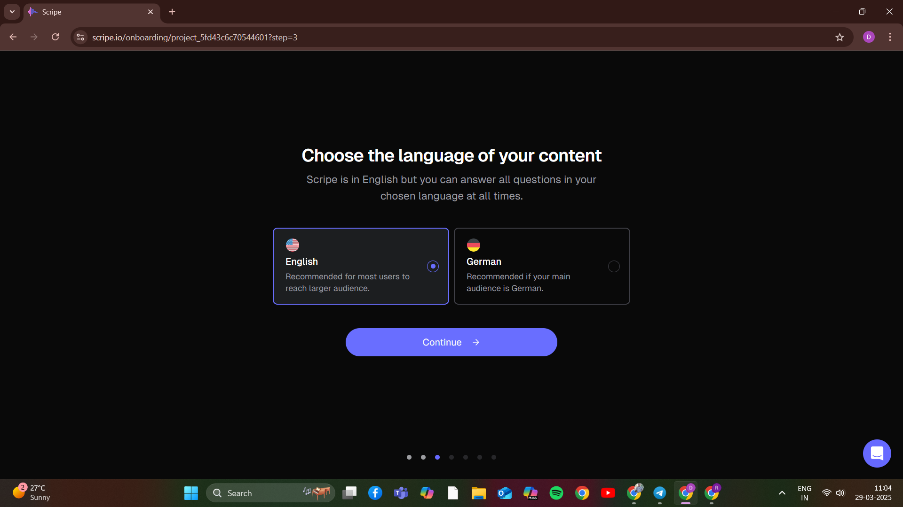
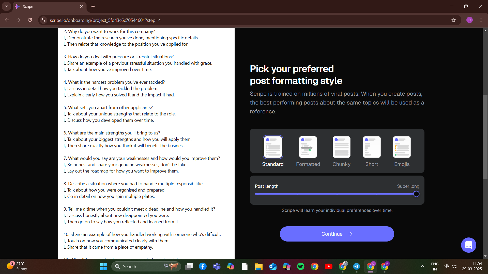
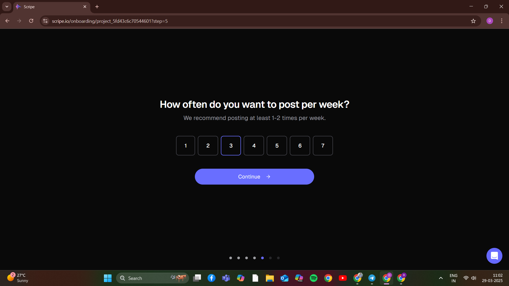
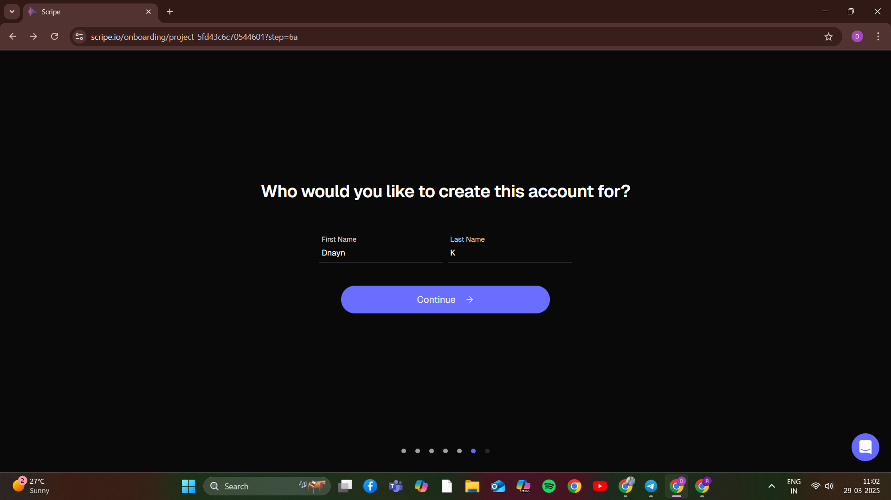

# Scripe Clone - Authentication & Onboarding Flow Research

## Executive Summary

This document presents research findings on implementing authentication and onboarding flows similar to [Scripe.io](https://scripe.io/), a platform for LinkedIn content creation. The research focuses specifically on login options, user onboarding, and team invitation processes using MERN stack technologies.

Key findings:
- Three authentication methods (email, Google, LinkedIn) provide optimal user flexibility
- Multi-step onboarding flow includes workflow selection, theme preference, language, and posting frequency
- Team invitation system stores invitations within the application for a seamless experience
- MongoDB data model supports all required user states and team workflows
- Passport.js integration enables secure multi-provider authentication

## Research Methodology

1. **Website Analysis**: Examined Scripe.io's structure and user flows
2. **UI/UX Review**: Analyzed screenshots of the authentication and onboarding process
3. **Technical Stack Assessment**: Evaluated MERN stack components suitable for implementation
4. **Systems Design**: Explored architectural approaches for implementing required functionality

## Authentication System

The application implements a robust authentication system with three methods:

1. **Email Authentication** - Traditional email/password signup and login
2. **Google OAuth** - Single-click login using Google's authentication API
3. **LinkedIn OAuth** - Single-click login using LinkedIn's authentication API (particularly relevant as this is a LinkedIn content platform)

### MERN Implementation Approach

#### Frontend Strategy
For the frontend implementation, React provides the perfect foundation for building the authentication interfaces. The authentication flow should be structured as follows:

- Create a centralized authentication state using Redux or Context API
- Implement protected routes that redirect unauthenticated users
- Design responsive login/signup forms that support all three authentication methods
- Handle form validation client-side before submission
- Store authentication tokens securely (preferably in HTTP-only cookies)

#### Backend Strategy
Express.js serves as the backend framework with these key components:

- Passport.js as the authentication middleware, which allows for modular authentication strategies
- JWT (JSON Web Token) for stateless, secure user sessions
- bcrypt for secure password hashing to protect user credentials
- MongoDB for storing user profiles and authentication data

#### How Authentication Methods Work

1. **Email Authentication Process**:
   - User registers with email and password
   - Password is hashed with bcrypt before storage
   - On login, the provided password is hashed and compared to the stored hash
   - If successful, a JWT is generated and returned to the client

2. **Google OAuth Process**:
   - User clicks "Login with Google" button
   - Application redirects to Google's authentication servers
   - User authenticates with Google
   - Google redirects back with an authorization code
   - Backend exchanges code for user information
   - Application creates/retrieves the user and issues a JWT

3. **LinkedIn OAuth Process**:
   - Similar to Google OAuth but uses LinkedIn's authentication servers
   - Requires registration in LinkedIn Developer portal
   - Particularly valuable for this application due to LinkedIn content focus
   - Provides profile information and potentially access to LinkedIn API features

#### When and Where to Use Each Method

- **Email Authentication**: Essential as a baseline method that works for all users
- **Google OAuth**: Popular and widely used, reduces friction for users with Google accounts
- **LinkedIn OAuth**: Strategic for this application to leverage the LinkedIn ecosystem

#### Security Considerations

- Implement rate limiting to prevent brute force attacks
- Use HTTPS for all authentication traffic
- Set appropriate JWT expiration times (typically 15min to 24h)
- Implement refresh token rotation for extended sessions
- Store sensitive credentials only in secure environment variables
- Conduct regular security audits of the authentication system

## Complete Onboarding Flow

### Onboarding Steps Breakdown

#### Step 1: Workflow Selection
After authentication, users choose whether to set up a team workflow or personal workflow. If team workflow is selected, the user can invite team members by entering multiple email addresses separated by commas.

**Theory and Application**: This fork in the user journey establishes personalization immediately and configures the system appropriately for different use cases. The workflow selection impacts:
- Permission structures
- UI elements shown
- Feature availability
- Data relationships in the database

**When to Implement**: This should be the first step after authentication and before any other preferences, as it fundamentally affects the user experience structure.

#### Step 2: Team Invitation (Conditional)
If team workflow is selected, users need to invite team members before proceeding.

**Theory and Application**: The invitation system uses an asynchronous, database-driven approach:
- Invitations are stored in MongoDB, not sent via email
- Email addresses are parsed and validated
- Team-to-user relationships are established upon acceptance
- This allows for a fully contained, platform-native experience

**Where to Store Invitations**: Create a dedicated collection in MongoDB with these key fields:
- Team ID (reference to the team document)
- Invitee email address
- Status (pending, accepted, declined)
- Created date
- Invited by (reference to the user who sent the invitation)

**When to Display Invitations**: Users should see pending invitations:
- Immediately after login
- On a dedicated notifications area
- Via an indicator on the user dashboard

#### Steps 3-6: User Preferences
The following steps collect user preferences for:
- Theme (dark/light mode)
- Language (English/German)
- Post format preferences
- Posting frequency

**Theory and Application**: Multi-step preference collection offers several advantages:
- Reduces cognitive load by focusing on one decision at a time
- Creates a sense of progress and engagement
- Allows the system to adapt based on earlier choices
- Builds a personalized experience before the user reaches the main interface

**Where to Store Preferences**: Create a nested preferences object within the user document in MongoDB, allowing for:
- Efficient queries (single document retrieval)
- Logical grouping of related settings
- Easy addition of new preference types without schema changes

**When to Apply Preferences**: Preferences should be:
- Applied immediately when changed
- Persisted between sessions
- Retrievable on initial application load
- Synchronized across devices

#### Step 7: Dashboard Access
After completing the onboarding flow, users access the main dashboard.

**Theory and Application**: The main dashboard serves as the central hub for content creation and should:
- Reflect all selected preferences from the onboarding process
- Present clear pathways for content creation
- Show team activity if in team mode
- Provide easy access to key functionality

## Technical Implementation Concepts

### State Management Strategy

For a multi-step onboarding process, state management is critical. The recommended approach is:

1. **Global State Management**: 
   - Use Redux for complex state with many interconnected pieces
   - Define actions for each step of the onboarding process
   - Store the complete onboarding state in a single reducer
   - Persist state to local storage to handle page refreshes or navigation

2. **When to Update Backend**:
   - Minor preferences (theme, language): Save after each step
   - Major settings (workflow type, team): Save immediately after selection
   - Complete preference set: Synchronize at onboarding completion

3. **State Structure Design**:
   - Current step indicator
   - Completion status for each step
   - User selections at each step
   - Validation status
   - Error states

### Team Invitation System Architecture

The invitation system requires careful design to handle various scenarios:

1. **Database Schema Design**:
   - Users collection: Stores user profiles and authentication data
   - Teams collection: Defines team structure and members
   - Invitations collection: Tracks pending and processed invitations

2. **When to Check for Invitations**:
   - After each user login
   - Periodically while using the application
   - When explicitly checking notifications

3. **How to Process Acceptances**:
   - Update invitation status to "accepted"
   - Add user to team members array
   - Add team to user's teams array
   - Update permissions based on team role

4. **Edge Cases to Handle**:
   - Invitation to non-existent email
   - Multiple invitations to the same email
   - Team deletion while invitations are pending
   - User account creation after invitation

### Email Communication Architecture

While the core invitation system uses in-app notifications, email communication can be implemented as an optional feature:

1. **Service Selection Criteria**:
   | Service | When to Use | Why |
   |---------|-------------|-----|
   | SendGrid | Production applications with critical email needs | Excellent deliverability, comprehensive API, templates |
   | Mailgun | Applications with moderate email volume | Developer-friendly, good analytics |
   | AWS SES | High-volume, cost-sensitive applications | Very cost-effective, high send limits |
   | Nodemailer | Development, testing, small applications | Complete control, no external dependencies |

2. **Email Integration Patterns**:
   - Create an abstraction layer to allow switching providers
   - Implement a template system for consistent emails
   - Use a queue system for reliable delivery
   - Handle bounces and delivery failures

3. **Email Security Best Practices**:
   - Configure SPF, DKIM, and DMARC records
   - Use dedicated sending domains with proper DNS setup
   - Implement content sanitization
   - Follow anti-spam guidelines

### Content Generation System

The content generation system is the core functionality of the application, converting various inputs into LinkedIn-optimized posts:

1. **Input Processing Architecture**:
   - Support for YouTube URLs, document uploads, voice recordings
   - Extract metadata and content from each source type
   - Preprocess content for AI consumption
   - Store raw content for reference and reprocessing

2. **When to Use Queues**:
   - For any processing that takes more than 1-2 seconds
   - When handling large files or external API calls
   - For operations that might fail and need retries
   - To prevent blocking the main application thread

3. **AI Integration Strategy**:
   - Use OpenAI API for natural language generation
   - Design prompts specific to LinkedIn content best practices
   - Implement post-processing to ensure consistent output
   - Allow for user editing before final publishing

4. **Content Storage Approach**:
   - Store generated content in a Posts collection
   - Include metadata about source, creation time, status
   - Implement versioning for revisions
   - Link posts to users and teams appropriately

## Recommended Technologies and When to Use Them

### Frontend Technologies

1. **React.js**:
   - **When to use**: For all user interface components
   - **Why**: Component-based architecture perfect for reusable UI elements

2. **Redux/Context API**:
   - **When to use**: For managing global state like authentication and onboarding
   - **Why**: Provides predictable state management for complex flows

3. **React Router**:
   - **When to use**: For handling navigation between onboarding steps and main application
   - **Why**: Enables URL-based navigation and deep linking

4. **Tailwind CSS/Material UI**:
   - **When to use**: For consistent styling across the application
   - **Why**: Provides pre-designed components that speed up development

### Backend Technologies

1. **Node.js/Express.js**:
   - **When to use**: For all API endpoints and server-side logic
   - **Why**: JavaScript throughout the stack simplifies development

2. **Passport.js**:
   - **When to use**: For implementing authentication strategies
   - **Why**: Modular design supports multiple authentication methods

3. **JWT**:
   - **When to use**: For maintaining user sessions
   - **Why**: Stateless authentication with good security properties

4. **Mongoose**:
   - **When to use**: For MongoDB interactions
   - **Why**: Schema validation and simplified queries

### Database Technologies

1. **MongoDB**:
   - **When to use**: For storing all application data
   - **Why**: Flexible schema ideal for evolving data requirements

2. **MongoDB Atlas**:
   - **When to use**: For cloud hosting of the database
   - **Why**: Managed service with scaling, backup, and security features

### Infrastructure Components

1. **AWS/GCP/Azure**:
   - **When to use**: For hosting the application
   - **Why**: Scalable infrastructure with various supporting services

2. **Redis**:
   - **When to use**: For caching and job queues
   - **Why**: High-performance in-memory data store

3. **Bull Queue**:
   - **When to use**: For content processing and email sending
   - **Why**: Reliable job queue with monitoring and retry capabilities

### Integration Services

1. **OpenAI API**:
   - **When to use**: For generating LinkedIn content
   - **Why**: Advanced language models capable of creating engaging posts

2. **YouTube Data API**:
   - **When to use**: For extracting video information
   - **Why**: Official API provides reliable access to video metadata

3. **Google Cloud Speech-to-Text**:
   - **When to use**: For processing voice recordings
   - **Why**: High-accuracy transcription service

4. **LinkedIn API**:
   - **When to use**: For publishing content directly to LinkedIn
   - **Why**: Native integration with the target platform

## Research Findings & Recommendations

After analyzing Scripe.io's authentication and onboarding flow, here are the key research findings and recommendations:

### Authentication Recommendations

1. **Multiple Auth Options**: Implement all three authentication methods (email, Google, LinkedIn) to maximize user convenience and conversion rates.
   
2. **OAuth Integration**: LinkedIn OAuth integration should be prioritized given the platform's focus on LinkedIn content creation.

3. **Security**: Implement JWT-based authentication with proper refresh token rotation to maintain security.

### Onboarding Flow Recommendations

1. **Streamlined Experience**: Keep the onboarding steps focused and visually appealing to reduce drop-off rates.

2. **Team Invitations**: The in-app invitation system (rather than email invites) keeps the experience contained and reduces the chance of invitations going unnoticed.

3. **Preference Customization**: Allow users to set theme, language, and posting preferences during onboarding to create a personalized experience.

### Technical Recommendations

1. **Scalable Architecture**: Separate authentication logic and content processing into their own services for better scalability.

2. **Responsive Design**: All authentication and onboarding screens must be mobile-responsive given the increasing mobile usage for content creation.

3. **State Management**: Use Redux with proper auth state persistence to provide seamless UX across sessions and handle complex onboarding states.

## Potential Implementation Challenges

Based on the research, these are potential challenges that might arise during implementation:

1. **OAuth Configuration Complexity**: Setting up LinkedIn OAuth may require business verification and can have a complex approval process.

2. **Invitation System Edge Cases**: Handling scenarios like invited users already having accounts will require careful state management.

3. **Security Concerns**: Storing invitations in-app creates the need for robust security measures to prevent unauthorized access.

4. **Content Processing**: Video transcription and AI-based content generation require significant computational resources and may need a dedicated service.

5. **Team Permission Management**: As the system scales, defining granular permissions for team members could become complex.

## References

- [Scripe.io](https://scripe.io/)
- [Passport.js Documentation](http://www.passportjs.org/)
- [MongoDB Schema Design Best Practices](https://www.mongodb.com/developer/products/mongodb/mongodb-schema-design-best-practices/)
- [React Authentication Patterns](https://reactpatterns.com/)
- [LinkedIn OAuth API Documentation](https://docs.microsoft.com/en-us/linkedin/shared/authentication/authorization-code-flow)
- [MERN Stack Architecture Patterns](https://www.mongodb.com/languages/mern-stack-tutorial) 